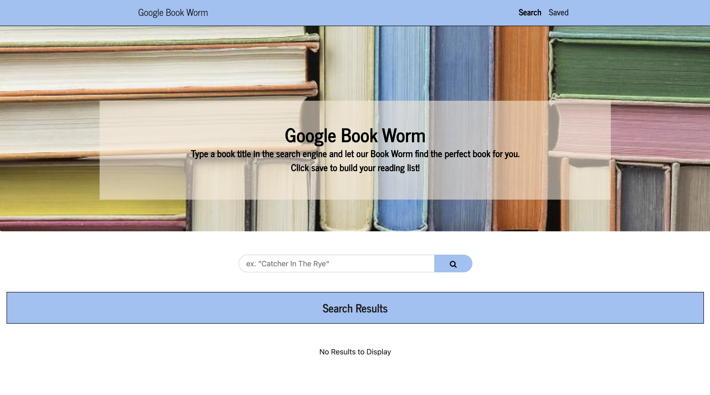

 # Google Book Worm
A MERN application to search and save a personal reading list via Google Books.


## Description

A MERN book search and save. Users can search by title and see a list. Users can either navigate to the google entry for that book or save it to their reading list. On the saved page, users can view books they've saved or delete them from their list.

## Table of Contents

* [Reference](#reference)
* [Details](#details)
* [Technologies](#technologies)
* [Installation](#installation)
* [Usage](#usage)
* [License](#license)
* [Contributing](#contributing)
* [Questions](#questions)
  
## Reference

Click [here](https://googlebookworm-production.up.railway.app/) to view the live application on Railway.

Screenshot of application
  

Search Page
  
  
Save Page
  

## Details
  * Search page allows user to search books by title.
    * Users view a list of returned titles.
    * Users can view a book's entry on Google.com.
    * Users can add a title to their saved list.
  * Saved page allows user to view saved list of books.
    * Users can view a book's entry on Google.com.
    * Users can delete book from their list.
 
  
## Technologies
Technologies used: CSS, JavaScript, React, React-DOM, React-Scripts, Bootstrap, Google Books API, Axios, Express, Mongoose, MongoDB

## Installation

To install all necessary materials for this project, run the following command:

```
npm install
```

## Usage

Be sure to install all node modules and packages locally before using the application.

## License

This application is protected under the MIT license.

For more information, visit this link: [MIT Info](https://opensource.org/licenses/MIT)

## Contributing
Design may be changed to the contributors needs and taste.

## Questions

If you have any questions, please reach out.
* GitHub: [AHFotis](https://github.com/AHFotis)
* Email: annahickey2@gmail.com
